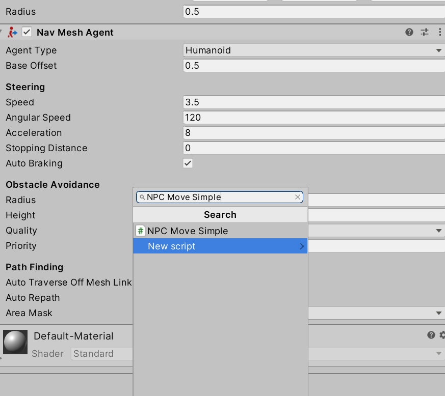

# Navigation!

Vi vil gerne lave AIs, i dag er fokus på at få dem til at navigere rundt i verdenen. 

Vi kommer til at bruge unities NavMesh bibliotek til at opnå det.

# Lav et navmesh
Lav en cube som hvores ai kan gå på (højreclick navigation vinduet og vælg **3D Object->Cube**)

Gør den stor så man kan gå den.

Åben navigation vinduet i **window->AI->Navigation**

Vælg platformen og i navigation vinduet i **Object** kategorien vælg **Navigation static**

I navigation vinduet i **Bake** kategorien tryk på **Bake**. Dette kommer til at generere navigations meshet som er det som ai kommer til at bruge til at finde rundt. Denne kommer vi til at bruge ofte

# Lab en ai der kan finde rundt på navmesh
Lav en npc der kommer til at gå rundt(jeg kommer til at lave en sphere, men brug gerne din egen figur her. højreclick navigation vinduet og vælg **3D Object->Sphere**)

Vælg den sphere der lige blev lavet og i **inspector vinduet** vælg **Add Component** og tilføj **Nav Mesh Agent**

Nu kan vores figur finde ud af at følge navigations meshet, men det har ingen anelse hvor det gerne vil hen.
Vi skal nu give den et mål den skal hen til.
For at gøre dette skal vi lave lidt kode.

Dette stykke kode kommer til at få aien til at følge efter et andet objekt, som kunne være en bold eller spilleren. 
koden skal placeres placeres hvor som helst i Assets, men det er nok en god idé at putte det i en **Scripts** folder
[Simple Navigation](scripts/NPCMoveSimple.cs)
Når vi har lavet vores script skal vi tilføje det til AIen. dette gøres ved at bruge **Add Component** og vælge NPCMove

Nu skal vi lave en ting som den kan følge efter, dette kommer til at være en capsule i mit tilfælde.(højreclick navigation vinduet og vælg **3D Object->Capsule**)

Det sidste der skal gøres er at vælge AIen (sphere) give den et mål den skal gå hen til. Dette gøres ved at **trække capsule og i Target**. Target kan ses i inspektor vinduet i NPC Move scriptet

Start spillet og se din npc løbe efter målet.

# Forhindringer
For at placere ting som aien ikke kan gå igennem lav en genstand(såsom en cube) som placer den på banen lige i som i **Lav et Navmesh** sektionen. 

En alternativ måde at gøre det på er at lave en genstand og **Add Component** **Nav Mesh Obstacle**. Forskellen mellem de løsninger at man kan flytte på genstanden imens spillet er i gang hvis man bruger **Nav Mesh Obstacle**. Tilgengæld er spillet nok en smulle langsomere end hvis man gør genstande **Navigation static**

# Flere navmesh ting
Dette bibliotek indeholder udvidelser til navmesh såsom links mellem 2 platforme 

https://github.com/Unity-Technologies/NavMeshComponents

## Idéer til udvidelser

- lav et custom map og få AI til løbe rundt i det.
- Få en fjende til at følge efter spilleren
- få en fjende til at gå frem og tilbage mellem 2 punkter